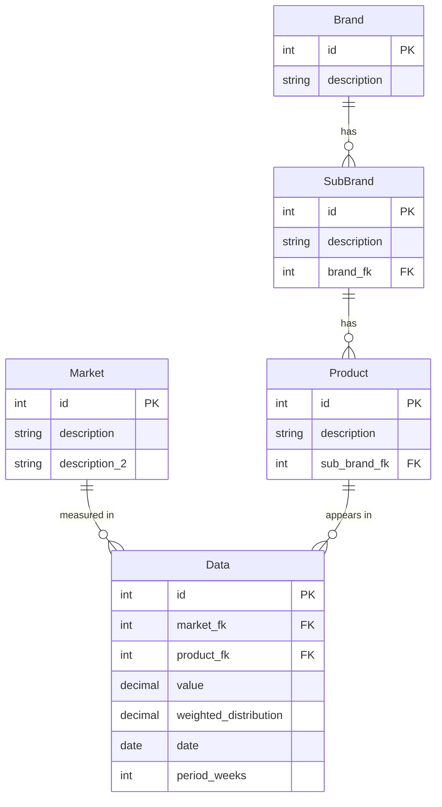

# Spec 002 — Database Schema

Define the PostgreSQL schema to store retail sales data. Five entities: `Market`, `Brand`, `SubBrand`, `Product`, and `Data`. The brand hierarchy (`Brand → SubBrand → Product`) is fully normalized. `Data` is the fact table linking a product and a market to a sales measurement at a point in time.

---

## Entity Relationship Diagram

---

## Entities

### Brand

| Field | Type | Nullable | Description |
|---|---|---|---|
| `id` | int (PK) | No | Auto-generated primary key |
| `description` | string | No | Brand name |

---

### SubBrand

| Field | Type | Nullable | Description |
|---|---|---|---|
| `id` | int (PK) | No | Auto-generated primary key |
| `description` | string | No | Sub-brand name |
| `brand_fk` | int (FK → Brand) | No | Parent brand — CASCADE on delete |

---

### Product

| Field | Type | Nullable | Description |
|---|---|---|---|
| `id` | int (PK) | No | Auto-generated primary key |
| `description` | string | No | Full product description |
| `sub_brand_fk` | int (FK → SubBrand) | No | Parent sub-brand — CASCADE on delete |

---

### Market

| Field | Type | Nullable | Description |
|---|---|---|---|
| `id` | int (PK) | No | Auto-generated primary key |
| `description` | string | No | Primary market identifier (e.g. `"MARKET3"`) |
| `description_2` | string | No | Secondary market / retailer description (e.g. `"TOT RETAILER 1"`) |

---

### Data

| Field | Type | Nullable | Description |
|---|---|---|---|
| `id` | int (PK) | No | Auto-generated primary key |
| `market_fk` | int (FK → Market) | No | Market where the measurement was taken — CASCADE on delete |
| `product_fk` | int (FK → Product) | No | Product being measured — CASCADE on delete |
| `value` | decimal(12,2) | No | Sales value for the period |
| `weighted_distribution` | decimal(5,2) | Yes | Weighted distribution percentage (e.g. `85.85` = 85.85%); NULL when not reported in the source data |
| `date` | date | No | End date of the reporting period |
| `period_weeks` | int | No | Duration of the reporting period in weeks |

---

## Acceptance Criteria

1. All five tables exist in the PostgreSQL database: `brand`, `subbrand`, `product`, `market`, `sales_data`.
2. All foreign keys use `ON DELETE CASCADE`: deleting a `Brand` cascades to its `SubBrand` rows, then to `Product`, then to `Data`; deleting a `Market` cascades to its `Data` rows.
3. All columns have `NOT NULL` constraints except `Data.weighted_distribution`, which is nullable (NULL when the source data does not report a WTD value).
4. `Data.value` is stored as `decimal(12, 2)` (e.g. `32.40`). `Data.weighted_distribution` is stored as `decimal(5, 2)` representing a percentage (e.g. `85.85` = 85.85%), or NULL when not reported.
5. Django migrations apply cleanly against the PostgreSQL instance defined in spec 001 (`redslim-exercise` DB, `redslim` user).
